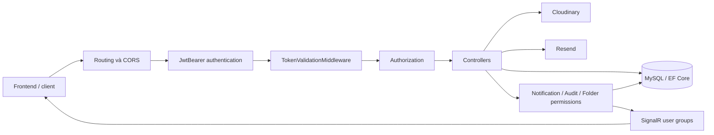

# DocShareAPI — Tài liệu và review toàn bộ backend

Ngày review: **03/10/2026**, múi giờ Asia/Saigon. HEAD lúc bắt đầu: `d801b73`; HEAD lúc hoàn tất: `e0853d7`.

## 1. Phạm vi và kết luận

Tài liệu mô tả backend hiện tại, kiến trúc, dữ liệu, chức năng, API, cấu hình, vận hành, kiểm thử và các vấn đề cần xử lý. Nguồn chính là mã trong `DocShareAPI`, test trong `DocShareAPI.Tests`, SQL/tài liệu trong `docs`, Docker và GitHub Actions.

Review dựa trên **working tree**. Lúc bắt đầu, solution và các controller thư viện/thư mục có thay đổi chưa commit, project test chưa được Git theo dõi; đến lúc hoàn tất, các thay đổi đó đã có trong HEAD `e0853d7`. Agent review chỉ tạo tài liệu này, không commit hay sửa mã nghiệp vụ, không chạy migration hay gọi dịch vụ production. Các file phát sinh của build/test nằm trong thư mục output thông thường; chương trình kiểm chứng bổ sung nằm trong thư mục tạm hệ thống.

**Kết luận:** dự án có phạm vi chức năng rộng và build/test hiện có thành công, nhưng cần sửa các lỗi quyền truy cập, JWT và di chuyển tài liệu trước khi xem là sẵn sàng cho dữ liệu riêng tư trong production. 11 test pass không chứng minh các chức năng ngoài thư viện đã đúng.

Mức ưu tiên trong tài liệu:

| Mức | Ý nghĩa |
| --- | --- |
| P1 | Cần xử lý sớm: quyền truy cập, phiên đăng nhập, chức năng chính bị lỗi |
| P2 | Sai nghiệp vụ, tính nhất quán, giới hạn tài nguyên hoặc vận hành |
| P3 | Khả năng bảo trì, tổ chức mã và tài liệu |

Trạng thái bằng chứng: **đã tái hiện** là chạy mã cục bộ; **đọc mã** là kết luận từ luồng thực thi; **cần tích hợp** là còn phụ thuộc MySQL, Cloudinary, proxy hoặc môi trường triển khai.

## 2. Công nghệ và cấu trúc

| Thành phần | Hiện trạng |
| --- | --- |
| API | ASP.NET Core, target `net8.0`, controller MVC |
| Database | MySQL; EF Core qua Pomelo 8.0.2; cấu hình server version 8.0.29 |
| Xác thực | JWT HMAC SHA-256 + kiểm tra token đang hoạt động trong database |
| OAuth | Google ID token, kiểm tra audience bằng client ID cấu hình |
| Lưu file | CloudinaryDotNet 1.27.1 |
| Xử lý tài liệu | Aspose.Words/PDF 25.3.0; chuyển DOCX thành PDF ở luồng upload chính |
| Email | Resend HTTP API cho xác minh email, reset password và OTP |
| Realtime | SignalR, hub `/hubs/notifications` |
| OpenAPI | Swashbuckle 6.6.2, Swagger chỉ bật trong Development |
| Test | xUnit, EF Core InMemory, Microsoft.NET.Test.Sdk, coverlet |
| Triển khai | Docker multi-stage; GitHub Actions push image và gọi Render deploy hook |
| AI | Có source Gemini nhưng controller bị loại khỏi compilation |

Các package Google Cloud Storage, MailKit, Resend SDK có trong project; sự hiện diện của dependency không đồng nghĩa đang có luồng sử dụng tương ứng. Email hiện dùng `HttpClient` gọi Resend trực tiếp.

```text
DocShareAPI.sln
├── DocShareAPI/
│   ├── Program.cs                 # DI, cấu hình, middleware, endpoint
│   ├── Controllers/              # API và phần lớn nghiệp vụ
│   │   ├── Auth/                 # Documents, Likes, Reports
│   │   └── Public/               # Nội dung public, Google/Gemini liên quan
│   ├── Data/DocShareDbContext.cs  # Mapping, quan hệ, index
│   ├── Models/                   # 27 entity persistence + model token giải mã
│   ├── DataTransferObject/       # DTO; một số request vẫn khai báo trong controller
│   ├── Services/                 # Token, quyền folder, Cloudinary, notification, audit
│   │   └── EmailServices/
│   ├── Middleware/               # Kiểm tra token và quyền admin theo route
│   ├── Hubs/                     # SignalR notifications
│   ├── Helpers/                  # Hash, ID/OTP, PDF URL, pagination
│   └── Dockerfile
├── DocShareAPI.Tests/             # LibraryRegressionTests
├── docs/                         # API guides và SQL thủ công
├── .github/workflows/            # Build/push/deploy
└── csharp DocShareAPI/            # Bản source nằm ngoài project API
```

`csharp DocShareAPI/Controllers/LibraryItemsController.cs` nằm ngoài thư mục project, không phải controller đang được build. `Dockerfile.original` cũng không phải Dockerfile được compose sử dụng.

## 3. Kiến trúc và vòng đời request



Pipeline trong `Program.cs`: routing → CORS → HTTPS redirection → static files → authentication → token validation → authorization → controllers/hub. Static files có thể được phục vụ trước middleware token; điều này phù hợp cho robots/sitemap nhưng cần kiểm soát nội dung được ghi vào web root.

`TokenValidationMiddleware` thực hiện:

1. Xác định endpoint public theo `[AllowAnonymous]`, một số đường dẫn gốc và prefix public.
2. Đọc Bearer token; riêng hub hỗ trợ `access_token` trong query string.
3. Xác minh chữ ký/hạn JWT, rồi tìm token Access active/chưa hết hạn của user trong DB và đối chiếu hash.
4. Ghi danh tính vào `HttpContext.Items["DecodedToken"]`.
5. Chặn private request không có token hợp lệ.
6. Với `/api/admin`, đọc **Role hiện tại trong DB** để kiểm tra admin.

Controller sử dụng cả `DecodedToken` lẫn `[Authorize]`, nhưng chưa có lớp policy/resource authorization thống nhất. Prefix trong middleware và attribute trên controller đều ảnh hưởng tính public của API; đổi route phải kiểm tra cả hai.

Mã nghiệp vụ chủ yếu nằm trực tiếp trong controller. `DbContext` được inject và gọi ở nhiều lớp; notification/audit service cũng tự `SaveChangesAsync`, nên ranh giới transaction và side effect cần được xác định rõ.

## 4. Chức năng theo module

| Module / source | Chức năng và điểm cần lưu ý |
| --- | --- |
| `UsersController` | Profile, đăng ký, login, Google login, logout, bật/tắt 2FA, avatar. Login truyền thống trả nhiều lỗi nghiệp vụ bằng HTTP 200. |
| `VerificationController` | Verify email, reset password, đổi email với bước xác minh email hiện tại và xác nhận email mới. |
| `Auth/DocumentsController` | Upload đơn/batch/vào folder, metadata, trạng thái, preview, download, xóa. Luồng upload chính có kiểm tra MIME, extension và signature cơ bản. |
| `PublicDocumentsController` | Chi tiết, search có scoring, danh mục, lịch sử từ danh sách ID. Lọc soft delete chưa nhất quán. |
| `LibraryController` | My, team, shared, favorites, recent, trash, summary; DTO dùng chung cho folder/document. Nhiều danh sách được tải trước rồi phân trang trong RAM. |
| `LibraryItemsController` | Rename, move, copy, paste, merge folder, trash, restore, delete forever. Copy tài liệu dùng chung asset Cloudinary. |
| `FoldersController` | Folder tree, CRUD, document membership, member roles, invite/accept/decline/cancel, rời folder. Quyền không tự kế thừa từ folder cha trong permission service. |
| `FolderPermissionService` | Owner/member/public; quyền xem, bình luận, thêm/xóa tài liệu, sửa folder và quản lý member. |
| `CollectionsController` | Bộ sưu tập độc lập với folder; thêm/xóa liên kết tài liệu; API riêng tư và API public nằm ở controller khác. |
| `FavoritesController` | Favorite folder/document/collection, list và bật/tắt trạng thái. List chưa kiểm tra lại quyền tại thời điểm đọc. |
| `ShareLinksController` | Share token, password, hạn sử dụng, lượt xem/tải, revoke. `access` được lưu nhưng chưa thực thi. |
| `CommentsController` | Root comment và reply, sửa/xóa, mention và notification. Quyền tạo comment hiện chỉ dựa trên quyền xem. |
| `DocumentVersionsController` | Upload version, liệt kê, download và restore bằng cách tạo version mới. Validation/chuyển đổi khác upload chính. |
| `DocumentInsightsController` | View dedupe trong 30 phút, history, trending, recommended/following feed, analytics tổng và từng tài liệu. |
| `FollowsController`, `PublicFollowsController` | Follow/unfollow, danh sách follower/following và trạng thái. Chặn tự follow, khóa ghép chống trùng. |
| `NotificationsController` | List, unread count, đánh dấu đọc và xóa notification theo recipient. |
| `NotificationSettingsController` | Lưu lựa chọn in-app/email; email preferences chưa gắn với luồng gửi email sự kiện. |
| `NotificationService`, `NotificationsHub` | Lưu notification, phát `ReceiveNotification`, `UnreadCountChanged` tới group `user:{GUID}`. |
| `StorageController` | Quota mặc định 10 GiB, thống kê dung lượng, admin đổi giới hạn. Chỉ tính document đang active. |
| `WorkspaceActivityController` | Tổng hợp notification, share, version, invite, report, audit thành timeline. |
| `AdminController` | Dashboard, users, documents, categories, tags, reports, collections, analytics. |
| `AdminAuditController`, `AuditLogService` | Lưu/xem audit theo actor/action/entity. Một số thao tác chưa ghi audit. |
| `AdminSeoController` | Settings SEO, robots, sitemap routes/generate/preview; ghi file vào web root. |
| `TagsController`, `PublicCategoriesController`, `PublicUsersController` | Tra cứu tag/category/tree và hồ sơ/nội dung public của user. |
| `GeminiAIGenerateController` | Có code summary/chat nhưng `Compile Remove` trong `.csproj`; endpoint không hoạt động trong bản build hiện tại. |

## 5. Dữ liệu và quan hệ

`DocShareDbContext` khai báo 27 DbSet:

| Nhóm | Bảng/entity | Quan hệ chính |
| --- | --- | --- |
| Tài khoản | `USERS`, `TOKENS` | User GUID; token thuộc user, có type/expiry/active/device |
| Tài liệu | `DOCUMENTS`, `DOCUMENT_VERSIONS` | Chủ sở hữu; tài liệu có nhiều version; version number unique theo document |
| Phân loại | `CATEGORIES`, `TAGS`, `DOCUMENT_CATEGORIES`, `DOCUMENT_TAGS` | Category tự tham chiếu; document nhiều category/tag qua khóa ghép |
| Bộ sưu tập | `COLLECTIONS`, `COLLECTION_DOCUMENTS` | User sở hữu collection; quan hệ nhiều-nhiều tới document |
| Thư mục | `FOLDERS`, `FOLDER_DOCUMENTS` | Folder cha/con; document chỉ có tối đa một folder nhờ unique index `document_id` |
| Cộng tác | `FOLDER_MEMBERS`, `FOLDER_INVITES` | Role theo folder, invite có token/status/expiry và recipient |
| Tương tác | `FOLLOWS`, `LIKES`, `COMMENTS`, `REPORTS` | Follow khóa ghép; reaction ±1; comment reply; report có trạng thái |
| Chia sẻ | `FAVORITES`, `SHARE_LINKS` | Tham chiếu đa hình bằng `item_type`, `item_id`; không có FK tới từng loại item |
| Theo dõi | `DOCUMENT_VIEWS`, `DOCUMENT_DOWNLOADS`, `AUDIT_LOGS` | Event theo document/user/source/time; audit entity/type/action |
| Hệ thống | `NOTIFICATIONS`, `NOTIFICATION_SETTINGS`, `SEO_SETTINGS` | Recipient, tùy chọn theo user, SEO singleton |

Index hữu ích đã có: Email/Username unique, hash token unique, token theo user/type/active/expiry, document theo public/date và owner/deleted, folder theo owner/parent/name, favorite theo user/type/item, notification theo recipient/read/time, version theo document/number.

### 5.1. Folder roles đang thực thi

| Vai trò | Xem | Bình luận theo service | Thêm document | Xóa liên kết document | Sửa folder | Quản lý member | Xóa folder |
| --- | --- | --- | --- | --- | --- | --- | --- |
| owner | Có | Có | Có | Có | Có | Có | Có |
| admin của folder | Có | Có | Có | Có | Có | Có | Không |
| editor | Có | Có | Có | Có | Có | Không | Không |
| contributor | Có | Có | Có | Không | Không | Không | Không |
| commenter | Có | Có | Không | Không | Không | Không | Không |
| viewer | Có | Không | Không | Không | Không | Không | Không |
| public | Có | Không | Không | Không | Không | Không | Không |

Đây là ma trận của **service**, không phải cam kết mọi endpoint đều tuân thủ. `admin` của folder là member role; `USERS.Role=admin` là vai trò quản trị hệ thống và được kiểm tra riêng ở nhiều controller.

### 5.2. Soft delete và phiên bản

Folder/document có `deleted_at`, `deleted_by`, `deleted_root_type`, `deleted_root_id`, `original_parent_folder_id`. Xóa cây folder gom các item theo root xóa; restore tìm parent còn tồn tại và giải quyết trùng tên. Xóa vĩnh viễn xóa quan hệ phụ trong transaction.

Không có global query filter soft delete. Mỗi query phải tự lọc; đây là nguyên nhân một số API legacy vẫn trả dữ liệu trash.

Restore version tạo bản ghi version mới rồi trỏ metadata document về asset cũ. Version hiện chỉ lưu URL/asset/size/pages và chưa lưu đầy đủ `file_type`/thumbnail, nên khôi phục metadata có thể không đầy đủ khi hỗ trợ nhiều định dạng.

### 5.3. Schema và migration

Không tìm thấy thư mục EF Migrations hay tự gọi `Database.Migrate()` khi khởi động. Schema được quản lý bằng SQL:

| File | Vai trò |
| --- | --- |
| `table.sql` | Snapshot nhiều bảng; có FK trỏ tới bảng khai báo phía sau và identifier bằng dấu nháy kép |
| `fix-existing-schema-migration.sql` | Sửa schema hiện hữu, khóa/index/FK và một số dữ liệu cũ |
| `feature-upgrades-schema.sql` | Bảng favorite/share/comment/views/settings/audit/download/version và quota |
| `feature-upgrades-existing-db-migration.sql` | Bổ sung column/index còn thiếu của bảng đã có; header yêu cầu chạy sau feature schema |
| `library-trash-delete-migration.sql` | Cột/index soft delete của thư viện |
| `create_notifications_table.sql` | Notification table; cần rà soát cột folder so với model hiện tại |
| `create_seo_settings_table.sql` | SEO singleton và giá trị khởi tạo |

Các script không tạo thành một bộ cài đặt database mới đã được kiểm thử. Không chạy toàn bộ theo thứ tự tên file: cần so schema thực tế, SQL mode, thứ tự FK và các ALTER đã tồn tại; thử trên database rỗng hoặc bản sao trước. Review này chưa chạy SQL trên MySQL.

## 6. Luồng nghiệp vụ cần hiểu

### 6.1. Đăng nhập và phiên

Login email/username → verify password → nếu bật 2FA, tạo token loại `TwoFactorLogin`, gửi OTP email và lưu cache `2FA:{userId}` 5 phút → verify temp token/OTP → lưu token Access.

Access JWT có hạn **3 ngày**, claims `userID`, `roleID`; DB lưu hash thay vì token thô. Middleware kiểm tra DB ở mỗi request. Enum có `Refresh` nhưng chưa thấy endpoint refresh token hoạt động. Không nên thiết kế frontend dựa trên giả định đã có refresh flow.

Google login kiểm tra ID token với client ID, issuer, expiry và email verified, tìm/tạo user bằng email rồi cấp Access token trực tiếp. Cần quyết định chính sách 2FA cho OAuth vì luồng này hiện không đi qua bước OTP của tài khoản đã bật 2FA.

### 6.2. Upload

Upload chính kiểm tra token, user đã verify, kích thước mặc định 10 MiB, MIME/extension/signature, quota; chuyển DOCX thành PDF rồi upload Cloudinary, ghi DB và notification. Batch upload giới hạn upload song song theo cấu hình nhưng giới hạn đó ở phạm vi xử lý request, chưa phải hạn mức toàn hệ thống.

Cloudinary và MySQL không cùng transaction. Luồng upload chính có cleanup khi lỗi; version upload cần bổ sung cơ chế tương tự. Chuyển DOCX có thể làm kích thước PDF khác file đầu vào, nên quota phải xét đúng kích thước cuối cùng.

### 6.3. Library, copy và trash

Item DTO có `type`, `id`, tên, parent, owner, URL, trạng thái, favorite và capability. Frontend phải đọc capability để hiển thị thao tác, còn backend vẫn phải kiểm tra quyền trên mọi mutation.

`CopyDocument` tạo record mới thuộc người copy nhưng giữ `public_id`, `asset_id`, `file_url` của bản gốc; đây là bản sao metadata dùng chung asset, không phải upload bản sao độc lập. Move thay folder link; paste chọn move/copy. Merge tạo folder mới và gom các tài liệu đã kiểm tra quyền.

### 6.4. Share link và notification

Share token được tạo từ random bytes, có thể thêm password, expiry và giới hạn lượt. Public endpoint trả item/permission/allowDownload. Password verification hiện trả item trực tiếp; không cấp grant cho lần download sau.

Notification được persist rồi gửi SignalR theo user group. REST list và unread count là nguồn dữ liệu để đồng bộ khi mất kết nối. Chưa có backplane được cấu hình để phát SignalR qua nhiều instance.

## 7. Findings ưu tiên

### F01 — P1: Favorites giữ quyền xem sau khi bị thu hồi — đã tái hiện

**Nguồn:** `Controllers/FavoritesController.cs:48,113`; `LibraryController.ToDocumentItem`.

List lấy favorite theo user, sau đó `BuildFavoriteItem` đọc item chỉ theo ID/trạng thái và gán role `viewer`, không kiểm tra lại `CanViewItem`. Nếu document đổi public → private hoặc member bị xóa, favorite vẫn trả tên, owner và **fileUrl**.

Probe cục bộ với favorite tồn tại nhưng user không sở hữu document private cho thấy response có `items[0].fileUrl` và `permissions.canView=true`.

**Sửa:** áp quyền hiện tại khi list/build DTO; filter các item không còn truy cập được trước count/pagination. Kiểm tra cả collection và folder. Test public→private và revoke membership.

### F02 — P1: File private và giới hạn download chưa được bảo vệ ở tầng asset — đọc mã, cần tích hợp CDN

**Nguồn:** `Auth/DocumentsController.UploadToCloudinary`, `DocumentVersionsController.UploadToCloudinary`, `ShareLinksController.BuildShareItem`.

Upload dùng `ImageUploadParams` không cấu hình delivery type/access control; nhiều response trả URL Cloudinary trực tiếp. Share document trả `fileUrl`/`previewUrl` ngay cả khi `allowDownload=false`. Người đã có URL có thể bỏ qua endpoint download, giới hạn lượt hoặc revoke share. Thay `is_public` trong MySQL không tự đổi ACL asset.

Cloudinary mô tả delivery type `upload` mặc định truy cập qua CDN public; xem [tài liệu kiểm soát media](https://cloudinary.com/documentation/control_access_to_media). Chưa kiểm tra cấu hình tài khoản Cloudinary hoặc thử tải asset thật; ảnh hưởng cụ thể phụ thuộc cấu hình đó.

**Sửa:** thiết kế asset authenticated hoặc URL ký ngắn hạn/gateway sau kiểm tra quyền. Preview phải dùng cùng cơ chế; không hứa cấm người xem lưu nội dung đã được gửi về máy họ. Revoke link phải ngừng cấp quyền truy cập asset mới.

### F03 — P1: JWT tạo liên tiếp có thể trùng — đã tái hiện

**Nguồn:** `Services/TokenServices.cs:17`, `Data/DocShareDbContext.cs:98`.

JWT chỉ có user/role và expiry tính theo giây, không có claim ngẫu nhiên `jti`. Hai lần tạo cho cùng user/role trong một giây cho kết quả **`RepeatedJWT=True`**. Hash token cũng trùng, trong khi cột token có unique index. Login/resend/2FA liên tiếp có thể bị lỗi ghi DB; token tạm và token Access có thể trùng nếu cấp cùng giây.

**Sửa:** thêm `jti` ngẫu nhiên cho mọi token, tách purpose/token type và lifetime của token tạm; test uniqueness khi tạo hàng loạt trong cùng giây và khi verify OTP nhanh. Probe xác nhận JWT trùng; lỗi unique DB cần test MySQL.

### F04 — P1: Di chuyển document sửa một phần khóa chính EF — đã tái hiện

**Nguồn:** `Data/DocShareDbContext.cs:189`; `LibraryItemsController.cs:713,833`; `FoldersController.MoveDocumentToFolder`.

`FOLDER_DOCUMENTS` có khóa ghép `(folder_id, document_id)`, nhưng move/restore gán trực tiếp `link.folder_id=...` trên entity đang tracked. Probe `SaveChangesAsync` phát sinh `InvalidOperationException`: `folder_id` là một phần key và không thể sửa. Move từ thư mục hiện hữu sang thư mục khác, và merge các document đã có folder, có thể thất bại.

**Sửa:** xóa link cũ và tạo link mới trong transaction với thứ tự save phù hợp, hoặc thay mô hình khóa để folder ID là FK có thể cập nhật. Test với MySQL và luồng HTTP, gồm root→folder, folder→folder, folder→root, restore, merge.

### F05 — P1: Tài liệu trash vẫn được trả qua API public — đã tái hiện chi tiết

**Nguồn:** `PublicDocumentsController.GetDocumentByID`, `GetDocumentsByCategoryId`, `GetHistoryDocuments`; `PublicUsersController.GetPublicCollectionById`.

Các query kể trên thiếu `deleted_at==null`. Với document public đã có `deleted_at`, probe endpoint chi tiết vẫn trả **`OkObjectResult`** và URL file. Search mới đã lọc deleted, nên kết quả giữa các API không nhất quán.

**Sửa:** bổ sung active filter cho mọi read/reaction/collection legacy, hoặc dùng query filter có `IgnoreQueryFilters` rõ ràng cho trash/admin. Test public detail/category/history/collection sau xóa và sau restore.

### F06 — P1: Thu hồi role admin chưa áp dụng ở các API ngoài `/api/admin` — đọc mã

**Nguồn:** `Middleware/TokenValidationMiddleware`; `AdminController.UpdateUser`; các helper dùng `decodedToken.roleID` trong Documents, Comments, Versions, LibraryItems.

Middleware đọc role DB mới chỉ khi route bắt đầu `/api/admin`. Admin bị hạ xuống user vẫn có token active chứa role cũ tối đa 3 ngày, và các route khác tin claim admin để bỏ qua ownership. Update role chưa vô hiệu hóa token hay cập nhật danh tính đang giải mã.

**Sửa:** revoke token khi đổi role hoặc dùng role hiện tại cho resource authorization ở mọi route. Test hạ quyền rồi gọi mutation tài liệu người khác bằng token cũ.

### F07 — P1: Viewer có thể bình luận; contributor có thể sửa nội dung tài liệu — đọc mã

**Nguồn:** `CommentsController.CreateComment`; `DocumentVersionsController.cs:310`; `FolderPermissionService`.

Create comment dùng `CanViewDocument` thay vì quyền comment, nên viewer có thể POST comment trong folder private. CanEditDocument của version dùng `CanAddDocumentToFolderAsync`, vốn cho contributor; contributor vì vậy có thể thay nội dung hoặc restore tài liệu của người khác thay vì chỉ thêm document.

**Sửa:** định nghĩa riêng quyền comment và edit document; tái sử dụng ở controller và DTO capability. Test từng vai trò; giữ quyền bình luận document public theo chính sách sản phẩm đã chọn.

### F08 — P1: OTP thiếu giới hạn thử và dùng Random — đọc mã

**Nguồn:** `Helpers/GenerateRandomCode.cs`; `UsersController.VerifyTwoFactorCode`; `Program.cs`.

OTP 6 số sinh bằng `new Random()`. Verify chỉ so chuỗi; chưa có giới hạn số lần thử, lockout hay rate limiter trong app cho login/verify/resend. Người có temp token có thể thử nhiều mã trong 5 phút; resend/login còn có thể tạo tải email và DB.

**Sửa:** RNG mật mã, giới hạn theo user/challenge/IP, attempt counter và thời gian chờ resend. Gắn OTP với challenge/token thay vì chỉ user. Kiểm tra thêm rate limit tại gateway nếu có; review chưa biết cấu hình gateway.

### F09 — P1: Đổi mật khẩu không thu hồi phiên Access — đọc mã

**Nguồn:** `VerificationController.ResetPassword`, dòng 562–567.

Reset chỉ thay password hash và deactivate token PasswordReset đang dùng. Token Access cũ vẫn active; người giữ token trước reset tiếp tục truy cập tới expiry.

**Sửa:** revoke Access/Refresh và challenge liên quan sau reset, bảo đảm atomic cùng thay password. Test token cũ nhận 401 sau reset.

### F10 — P2: Google login cấp Access trực tiếp cho user bật 2FA — đọc mã, cần chốt chính sách

**Nguồn:** `UsersController.GoogleLogin`.

Google login tìm user theo email rồi cấp token mà không xét `two_factor_enabled`. Nếu 2FA là bảo vệ mọi đăng nhập vào tài khoản DocShare, luồng OAuth đang bỏ qua nó. Google ID token hợp lệ không chứng minh người dùng vừa hoàn thành 2FA của DocShare.

**Sửa:** đưa OAuth vào cùng challenge 2FA, hoặc mô tả rõ chính sách coi Google là phương thức xác thực đủ tin cậy. Bổ sung liên kết external identity bằng provider/subject, thay vì chỉ email.

### F11 — P2: Quota không phản ánh toàn bộ dung lượng, copy bỏ qua quota — đọc mã

**Nguồn:** `StorageController.BuildStorage`, các `ValidateStorageQuota`, `LibraryItemsController.CopyDocument`.

Quota chỉ cộng `DOCUMENTS` active; không tính asset lịch sử version/trash. Upload version giữ asset cũ nhưng lần kiểm tra sau chỉ thấy size hiện tại. Copy tạo document mới không kiểm tra quota. Upload đồng thời đều có thể vượt giới hạn do check trước khi persist, không reservation/lock.

**Sửa:** quyết định quota tính dung lượng logic hay asset vật lý; theo dõi asset/version và reservation atomic. Kiểm tra kích thước sau chuyển đổi. Test batch/copy/concurrent/version/trash.

### F12 — P2: Upload version không nhất quán với định dạng hỗ trợ — đọc mã

**Nguồn:** `DocumentVersionsController.IsValidDocument`, `UploadNewVersion`, `RestoreVersion`; `Helpers/ConvertPdf.cs`.

Version chấp nhận PDF/DOC/DOCX/TXT theo MIME nhưng không chuyển DOCX sang PDF như upload chính. Sau upload lại luôn gọi helper chỉ nhận URL kết thúc `.pdf`; nếu Cloudinary trả asset không phải PDF, helper ném exception trước save. Version cũng thiếu kiểm tra extension/signature tương đương upload chính và cleanup asset khi lỗi.

**Sửa:** dùng chung validation/conversion/thumbnail pipeline, hoặc giới hạn version chỉ PDF rõ ràng. Lưu metadata định dạng mỗi version và restore cả `file_type`. Test file không phải PDF và cleanup khi DB save lỗi.

### F13 — P2: Cấp số version và bộ đếm share không an toàn khi đồng thời — đọc mã

**Nguồn:** `DocumentVersionsController` (`MaxAsync+1`); `ShareLinksController.ValidateAvailability`, `view_count++`, `download_count++`.

Hai request version có thể chọn cùng số và vướng unique constraint sau upload. Hai request share có thể cùng vượt qua giới hạn và ghi đè counter. Không có concurrency token hoặc conditional atomic update cho các luồng này.

**Sửa:** cấp số trong transaction/lock thích hợp, retry có kiểm soát, cleanup upload thừa. Dùng SQL update có điều kiện cho giới hạn/counter. Test đồng thời trên MySQL; InMemory không đại diện hành vi lock/constraint.

### F14 — P2: Password share không có grant để download; `access` không được kiểm tra — đọc mã

**Nguồn:** `ShareLinksController.CreateOrUpdateShareLink`, `GetActivePublicLink`, `VerifyPassword`, `DownloadPublicShare`.

`access` nhận chuỗi bất kỳ nhưng public read chỉ kiểm tra token/revoked/expiry/counters/password. Thay access không đổi quyền truy cập. Verify password trả item, nhưng download luôn Forbid khi link có password, kể cả vừa verify thành công. Permission editor chỉ là metadata, chưa có luồng sửa public tương ứng.

**Sửa:** validate enum và thực thi access policy; cấp grant ngắn hạn gắn share token/revoke state sau xác minh password; không trả capability editor nếu chưa hỗ trợ mutation.

### F15 — P2: Xóa vĩnh viễn không dọn asset Cloudinary — đọc mã

**Nguồn:** `LibraryItemsController.DeleteDocumentForever`, `DeleteFolderForever`, `DeleteDocumentDependencies`.

Luồng xóa thư viện xóa record/quan hệ DB nhưng không gọi destroy asset. Field Cloudinary service được inject không tạo ra cleanup trong những phương thức này. File và asset version có thể còn tồn tại/tốn dung lượng sau delete forever.

**Sửa:** cleanup job/outbox cho asset hết tham chiếu. Vì copy dùng chung asset, không được destroy ngay theo document ID mà phải kiểm tra mọi tham chiếu document/version trước. Theo dõi cleanup retry và asset mồ côi.

### F16 — P2: Notification có thể được phát trước commit — đọc mã

**Nguồn:** `Services/NotificationService.cs`; upload document và accept invite có transaction ngoài.

Service save rồi phát SignalR ngay; caller có thể chưa commit transaction. Client nhận sự kiện trước khi DB commit hoặc sự kiện cho transaction bị rollback. Ở luồng khác, nghiệp vụ đã save nhưng email/audit/SignalR fail làm request báo lỗi dù thay đổi đã có.

**Sửa:** outbox hoặc dispatch sau commit; phân biệt lỗi nghiệp vụ và side effect, dùng idempotency cho retry. Test mô phỏng SignalR/audit fail và rollback sau notification.

### F17 — P2: HTTP body không giới hạn và scale-out chưa có cấu hình chung — đọc mã

**Nguồn:** `Program.cs:17,150,158`; `UsersController.SaveTwoFactorCode`.

Kestrel không giới hạn body; multipart đặt `long.MaxValue`. Check 10 MiB ở action diễn ra sau model binding, nên request lớn/batch có thể gây tiêu thụ RAM/disk trước validation. `AddDistributedMemoryCache` lưu OTP trong từng process dù interface tên distributed; restart hoặc request sang instance khác làm mất challenge. SignalR cũng chưa có backplane.

**Sửa:** request/multipart/batch cap tại app và proxy, timeout/cancellation; cache chia sẻ hoặc challenge trong DB và cơ chế SignalR nhiều instance. Test request quá lớn và verify OTP qua hai instance.

### F18 — P2: Edge case tài khoản gây lỗi thay vì phản hồi xác thực — đọc mã

**Nguồn:** `UsersController.Register`, `GetMaskedContact`; `Helpers/PasswordHasher.cs`.

Username lấy phần trước `@` trong khi Username unique: hai email khác domain nhưng cùng local part sẽ va chạm. `Substring(0,3)` trong mask email gây lỗi với `a@...`/`ab@...`. Google user có `password_hash=string.Empty`; verify password không validate hash length nên có thể ném lỗi copy buffer khi dùng login password cho account đó.

**Sửa:** username generation chống trùng hoặc cho user chọn; mask theo độ dài; fail an toàn với account không có local password/hash lỗi. Test các input này và chuẩn hóa email trước lưu.

### F19 — P2: Quyền xem bị dùng như quyền đổi vị trí tài liệu public — đọc mã

**Nguồn:** `FoldersController.MoveDocumentToFolder`, `AddDocumentToFolder`; unique index `FOLDER_DOCUMENTS.document_id`.

Move cho qua `CanAccessDocument` khi document public dù requester không phải owner. Nếu tài liệu chưa có folder, user có quyền thêm vào folder của mình có thể đặt folder link cho document người khác. Vì chỉ một folder cho mỗi document, thao tác này thay vị trí chuẩn của bản gốc, không phải lưu bookmark/copy. API batch move lại yêu cầu owner/admin.

**Sửa:** thống nhất move ownership; muốn lưu document public vào thư viện người xem thì tạo copy hoặc bookmark/collection riêng. Test non-owner move public root document.

### F20 — P2: CI deploy chưa có cổng test và kiểm tra lỗi deploy hook — đọc mã

**Nguồn:** `.github/workflows/docker-image.yml`.

Workflow trên push master build/push image rồi gọi deploy hook, không chạy project test. `curl` gọi hook thiếu `--fail` nên HTTP lỗi có thể không làm step fail. Chưa thấy workflow kiểm tra pull request, health/readiness sau deploy hoặc migration gate.

**Sửa:** restore/build/test trước push/deploy, `curl --fail --show-error`, deploy theo image SHA và kiểm tra readiness. Chuẩn bị rollback image cùng tương thích schema. Không trigger deploy trong review.

## 8. Điểm tốt và cải thiện dài hạn

Điểm tốt: token DB được hash và kiểm tra active/expiry; key JWT được kiểm tra tối thiểu 32 byte; CORS ngoài Development yêu cầu cấu hình; admin route kiểm tra role DB; query read thường dùng `AsNoTracking`; nhiều index và khóa unique đã được định nghĩa; transaction kết hợp execution strategy xuất hiện ở các luồng nhiều bước; test regression thư viện đã có ca quyền truy cập và chu trình folder.

Các cải thiện P3, tách khỏi lỗi cần sửa ngay:

- Tách nghiệp vụ Document/Library/Share/Auth khỏi controller theo từng use case; không cần chuyển toàn bộ kiến trúc cùng lúc.
- Dùng resource authorization thống nhất cho document/folder/collection; DTO capability phải phản ánh cùng policy với mutation.
- Chuẩn hóa response lỗi bằng ProblemDetails hoặc envelope có `code`, `message`, `traceId`. Không trả `ex.Message`/DB inner exception ra client production.
- Version API hoặc lộ trình deprecate các route legacy. Hiện có `/api/Documents/...`, `/api/documents/...`, alias upload/download và Google alias ngoài `/api`.
- Chuẩn hóa camelCase/snake_case. Một số API trả cùng dữ liệu hai lần qua alias trường, tăng payload và chi phí bảo trì frontend.
- Dùng query DTO projection và pagination ở DB khi phù hợp; tránh tải toàn bộ folder/document/favorite rồi mới Skip/Take, tránh query riêng từng favorite/trash item.
- Kiểm tra quyền hiện tại khi lấy lịch sử view: query history hiện chỉ loại deleted, chưa kiểm tra document đã private/member bị revoke.
- Chỉ lưu dữ liệu mention/notification mà recipient được phép thấy; mention tài liệu private có thể tiết lộ tiêu đề tới user không có quyền.
- Email preferences được lưu nhưng notification service chỉ dùng `in_app_enabled`; chưa có dispatcher thực thi `email_on_*`.
- Đồng bộ thời gian OTP: cache login 5 phút nhưng template ghi 3 phút. Chỉ Email được triển khai dù enum có SMS/App.
- Chuẩn hóa password hash có version/cost và constant-time comparison; hiện PBKDF2-SHA256 10.000 iterations, không có metadata để nâng cost theo phiên bản. Đánh giá cost bằng benchmark và chính sách bảo mật, không thay hash cũ mà không có migration/rehash flow.
- Thêm issuer/audience validation đúng cấu hình và cân nhắc lifetime/refresh phù hợp; chưa có refresh endpoint hoàn chỉnh.
- Thêm health/readiness, correlation ID, structured log và metrics; `/` và `/api` chỉ báo process đang chạy, không kiểm tra DB.
- Không ghi share token thô vào audit nếu không cần: token là quyền truy cập link; giới hạn retention/visibility của log chứa token/query string.
- Robots/sitemap ghi filesystem cần kiểm tra quyền user không root trong container và khả năng tồn tại sau restart; serve từ DB hoặc storage bền vững nếu cần. HTTPS/proxy cần kiểm tra forwarded headers khi host/scheme được dùng tạo URL.
- Gom DTO nằm trong controller vào `DataTransferObject`; đổi namespace `ELearningAPI.Helpers` để nhất quán.
- Rà soát package không dùng, license Aspose và tài liệu nguồn ngoài project; không suy ra có lỗ hổng dependency chỉ từ số phiên bản. Review chưa audit CVE/license.

## 9. Cấu hình và cách chạy

### 9.1. Cấu hình thực tế trong source

Không có `appsettings.json` cơ sở trong danh sách source hiện tại. `appsettings.Development.json` chỉ chứa Logging. Local secrets cần được cung cấp từ environment/user-secrets hoặc cấu hình ngoài repo.

| Environment | Fallback configuration | Dùng cho |
| --- | --- | --- |
| `MYSQL_CONNECTION` | `ConnectionStrings:MysqlConnection` | MySQL connection string, bắt buộc |
| `JWT_SECRET_KEY` | `TokenSecretKey` | Signing key, tối thiểu 32 byte UTF-8 |
| `CORS_ALLOWED_ORIGINS` | `Cors:AllowedOrigins` | Danh sách origin phân cách dấu phẩy; bắt buộc ngoài Development |
| `SSL_CA_CERT` | Không | Ghi cert `/tmp/ca.pem`; connection string phải trỏ đúng CA nếu cần |
| `CLOUDINARY_CLOUD_NAME` | `Cloudinary:CloudName` | Cloudinary account |
| `CLOUDINARY_API_KEY` | `Cloudinary:ApiKey` | Cloudinary credential |
| `CLOUDINARY_API_SECRET` | `Cloudinary:ApiSecret` | Cloudinary credential |
| `GOOGLE_APP_CLIENT_ID` | `Google:ClientId` | Audience Google login |
| `RESEND_API_KEY` | `Resend:ApiKey` | Email API |
| `RESEND_FROM_EMAIL` | `Resend:FromEmail` | Sender đã cấu hình tại nhà cung cấp |
| `RESEND_VERIFY_EMAIL_TEMPLATE_ID` | `Resend:VerifyEmailTemplateId` | Verify/change email template |
| `RESEND_RESET_PASSWORD_TEMPLATE_ID` | `Resend:ResetPasswordTemplateId` | Reset email template |
| `TWO_FACTOR_EMAIL_TEMPLATE_ID` | `Resend:TwoFactorEmailTemplateId` | OTP template |
| `DOMAIN` | `DOMAIN` | URL frontend trong email |
| `APP_NAME` | `APP_NAME`, mặc định DocShare | Tên trong email |
| `PUBLIC_BASE_URL` | `PublicBaseUrl`, `DOMAIN`, request host | URL frontend share |
| `API_BASE_URL` | `ApiBaseUrl`, request host | URL API share download |
| `GEMINI_API_KEY` | `GeminiApiKey` | Options còn đăng ký dù controller AI không được compile |
| `MaxFileSize` | Giá trị trực tiếp qua configuration | Mặc định 10×1024×1024 byte |
| `AllowedDocumentTypes` | Array configuration | Mặc định PDF/DOC/TXT/DOCX MIME |
| `Cloudinary__MaxParallelUploads` | `Cloudinary:MaxParallelUploads` | Mặc định 3, clamp 1–6 |

Với key cấu hình phân cấp dùng environment provider .NET, sử dụng `__`, ví dụ `ConnectionStrings__MysqlConnection`. Array MIME dùng `AllowedDocumentTypes__0`, `__1`, v.v. Gemini options được đọc theo yêu cầu, nên đăng ký callback không chứng minh startup luôn yêu cầu Gemini key khi không có consumer.

### 9.2. Chạy local

Yêu cầu SDK hỗ trợ build net8.0, ASP.NET Core runtime tương ứng, MySQL với schema phù hợp; Cloudinary/Resend/Google cho các chức năng liên quan.

```powershell
# Từ thư mục gốc repository; thay các placeholder bằng cấu hình local.
$env:ASPNETCORE_ENVIRONMENT = 'Development'
$env:MYSQL_CONNECTION = 'Server=localhost;Port=3306;Database=docshare;User=docshare;Password=<local-password>;'
$env:JWT_SECRET_KEY = '<random-secret-at-least-32-bytes>'
$env:CORS_ALLOWED_ORIGINS = 'http://localhost:3000'
$env:CLOUDINARY_CLOUD_NAME = '<cloud-name>'
$env:CLOUDINARY_API_KEY = '<api-key>'
$env:CLOUDINARY_API_SECRET = '<api-secret>'

dotnet restore DocShareAPI/DocShareAPI.csproj
dotnet build DocShareAPI/DocShareAPI.csproj -c Release
dotnet test DocShareAPI.Tests/DocShareAPI.Tests.csproj -c Release
dotnet run --project DocShareAPI/DocShareAPI.csproj --launch-profile http
```

Profile HTTP trong `DocShareAPI/Properties/launchSettings.json` dùng `http://localhost:5252`; HTTPS dùng `https://localhost:7121` và HTTP 5252. Swagger ở `/swagger` trong Development. Có `UseHttpsRedirection`; nếu cần HTTPS local, cấu hình certificate/profile tương ứng.

Các lệnh chỉ là hướng dẫn; không tự tạo database hoặc schema. Environment trong PowerShell chỉ có hiệu lực với process con của phiên đó. Không commit giá trị secret. Có thể dùng user-secrets với project đã khai báo `UserSecretsId`.

### 9.3. Docker và deploy

Dockerfile build/publish Release bằng SDK 8.0, chạy aspnet 8.0 bằng `$APP_UID`, expose 8080/8081. Compose cơ sở chỉ có API, không tạo MySQL. Override phục vụ Development và mount secret/cert của Windows/Visual Studio; port `"8080"` không cố định host port.

Ví dụ build/run độc lập, sau khi tạo file environment ngoài Git bằng cấu hình ở bảng trên:

```powershell
docker build -f DocShareAPI/Dockerfile -t docshareapi:local .
docker run --rm --env-file <path-to-local-env-file> -e ASPNETCORE_ENVIRONMENT=Production -e ASPNETCORE_HTTP_PORTS=8080 -p 8080:8080 docshareapi:local
```

Production cần CORS, secret và MySQL đầy đủ, TLS tại host/proxy hoặc cấu hình certificate phù hợp. `SSL_CA_CERT` dùng đường dẫn Linux; chưa chứng minh tương thích Windows khi bật biến này. Không chạy deploy/Docker trong lần review này.

## 10. Kết quả kiểm thử và giới hạn

Lệnh đã chạy:

```text
dotnet test DocShareAPI.Tests/DocShareAPI.Tests.csproj --configuration Release --verbosity minimal
```

Kết quả: build API và tests thành công; **11 passed, 0 failed, 0 skipped**. SDK trên máy review: 9.0.318, runtime .NET/ASP.NET Core 8.0.31 có sẵn. Không gọi build toàn solution chứa `.dcproj`; bằng chứng build là project API được build qua test project.

Test hiện có bao phủ: sort trước pagination và tổng số item; breadcrumb không lộ parent không được phép; shared tree/capability viewer; merge từ chối document người khác; favorite từ chối deleted; move/copy folder vào chính nó hoặc descendant (4 ca theory); image filter/invalid sort; summary active favorites/root trash.

Probe tách khỏi repo dùng source project/EF InMemory xác nhận:

| Probe | Kết quả |
| --- | --- |
| Tạo hai JWT liên tiếp cho cùng user/role | Chuỗi token giống nhau |
| Public detail cho document public đã soft delete | Trả OkObjectResult |
| Favorite tồn tại nhưng user không có quyền document private | Trả item và URL file |
| Đổi folder_id của folder-document link tracked | InvalidOperationException vì sửa key |

Probe là bằng chứng hành vi cục bộ, chưa phải integration test HTTP/production. EF InMemory không kiểm tra đầy đủ FK/unique, SQL translation, transaction, lock, MySQL collation hay `ExecuteDelete/ExecuteUpdate`. Test đang bỏ qua cảnh báo transaction InMemory. Chưa thử email/CDN/SignalR thật, migration database mới, tải đồng thời, Docker runtime hoặc triển khai.

## 11. Thứ tự xử lý và test cần bổ sung

1. **Quyền và phiên:** F01/F02/F05/F06/F07/F08/F09; thống nhất resource policy, revoke và bảo vệ asset.
2. **Luồng chính:** F03/F04/F18; JWT độc nhất, sửa move key, edge case account.
3. **Chính sách sản phẩm:** chốt 2FA OAuth, role contributor, share access/password grant, quota logic/vật lý và semantics copy (F10/F11/F14/F19).
4. **Nhất quán dữ liệu:** version pipeline/concurrency, cleanup asset, notification sau commit (F12/F13/F15/F16).
5. **Vận hành:** body cap, nhiều instance, MySQL migration, CI test/deploy gate (F17/F20).

Các test integration nên chạy với MySQL test database và ASP.NET Core test host:

| Nhóm | Ca quan trọng |
| --- | --- |
| Auth | JWT uniqueness, invalid/expired/inactive token, reset revoke, role downgrade, OTP attempts/resend, Google 2FA |
| Quyền | Owner/admin/editor/contributor/commenter/viewer/public trên read/comment/edit/move/copy/share |
| Trash | Mọi API public và legacy sau delete; restore cây, parent mất, conflict tên |
| Library | Move document đã có folder, merge, multi-item partial success/rollback, cycle prevention |
| Favorite/history | Public→private, member revoke, deleted item, URL không được phép |
| Upload/version | MIME/extension/signature sai, non-PDF version, quota, conversion size, concurrent version, asset cleanup |
| Share | Password grant, expiry/revoke, access enum, max counters đồng thời, asset access sau revoke |
| Notification | Recipient isolation, OTP qua hai instance, SignalR failure, rollback/outbox, email preferences |
| Deploy/schema | Tạo DB từ đầu, nâng DB cũ, restart/container permissions, readiness, hook HTTP failure |

## 12. Tài liệu liên quan

Các guide hiện có là tài liệu bổ sung, cần đối chiếu source nếu có khác biệt:

- [Workspace/library API](workspace-library-api.md), [Trash/delete API](library-trash-delete-api.md).
- [Admin API](admin-api.md), [Reports API](reports-api.md), [Chi tiết report](report-feature-details.md).
- [Notifications API](notifications-api.md), [Follows API](follows-api.md), [Nội dung user public](public-user-content-api.md).
- [Frontend folder/notification guide](frontend-folder-notifications-build-guide.md), [Frontend feature upgrades guide](frontend-feature-upgrades-build-guide.md).
- [JWT key rotation](jwt-key-rotation.md).

Phụ lục bên dưới liệt kê route từ attribute trong controller được compile, kèm vị trí source để tra request/response chính xác. Không liệt kê controller Gemini bị exclude hay file controller ngoài project như API đang chạy. Quyền của route public vẫn phụ thuộc resource; “public/có điều kiện” không có nghĩa mọi document đều xem được.

## Phụ lục A. Danh mục route đang được compile

Danh mục trích từ assembly Release đã build. Cột tham số ghi tên và kiểu C#; binding, validation và schema chi tiết xem method/source. Quyền đăng nhập được xác định theo middleware hiện tại, sau đó controller còn kiểm tra ownership/member/admin. Alias `/Users/public/request-login-google` thiếu prefix public trong middleware và hiện vẫn bị yêu cầu token.

### AdminAuditController

Source: [AdminAuditController.cs](../DocShareAPI/Controllers/AdminAuditController.cs)

| Method | Route | Truy cập sơ bộ | Action / tham số |
| --- | --- | --- | --- |
| GET | `/api/admin/audit-logs` | Admin DB + controller | `GetAuditLogs` — paginationParams:PaginationParams, action:String, entityType:String, actorUserId:Guid? |

### AdminController

Source: [AdminController.cs](../DocShareAPI/Controllers/AdminController.cs)

| Method | Route | Truy cập sơ bộ | Action / tham số |
| --- | --- | --- | --- |
| GET | `/api/admin/dashboard` | Admin DB + controller | `GetDashboard` —  |
| GET | `/api/admin/users` | Admin DB + controller | `GetUsers` — paginationParams:PaginationParams, search:String, role:String, isVerified:Boolean?, sortBy:String, sortDirection:String |
| GET | `/api/admin/users/{userId:guid}` | Admin DB + controller | `GetUserDetail` — userId:Guid |
| PATCH | `/api/admin/users/{userId:guid}` | Admin DB + controller | `UpdateUser` — userId:Guid, request:AdminUpdateUserRequest |
| DELETE | `/api/admin/users/{userId:guid}` | Admin DB + controller | `DeleteUser` — userId:Guid |
| GET | `/api/admin/documents` | Admin DB + controller | `GetDocuments` — paginationParams:PaginationParams, search:String, userId:Guid?, isPublic:Boolean?, categoryId:String, tagId:String, sortBy:String, sortDirection:String |
| GET | `/api/admin/documents/{documentId:int}` | Admin DB + controller | `GetDocumentDetail` — documentId:Int32 |
| PATCH | `/api/admin/documents/{documentId:int}` | Admin DB + controller | `UpdateDocument` — documentId:Int32, request:AdminUpdateDocumentRequest |
| DELETE | `/api/admin/documents/{documentId:int}` | Admin DB + controller | `DeleteDocument` — documentId:Int32 |
| GET | `/api/admin/categories` | Admin DB + controller | `GetCategories` — search:String |
| POST | `/api/admin/categories` | Admin DB + controller | `CreateCategory` — request:AdminCategoryRequest |
| PATCH | `/api/admin/categories/{categoryId}` | Admin DB + controller | `UpdateCategory` — categoryId:String, request:AdminCategoryRequest |
| DELETE | `/api/admin/categories/{categoryId}` | Admin DB + controller | `DeleteCategory` — categoryId:String |
| GET | `/api/admin/tags` | Admin DB + controller | `GetTags` — search:String |
| POST | `/api/admin/tags` | Admin DB + controller | `CreateTag` — request:AdminTagRequest |
| PATCH | `/api/admin/tags/{tagId}` | Admin DB + controller | `UpdateTag` — tagId:String, request:AdminTagRequest |
| DELETE | `/api/admin/tags/{tagId}` | Admin DB + controller | `DeleteTag` — tagId:String |
| GET | `/api/admin/reports` | Admin DB + controller | `GetReports` — paginationParams:PaginationParams, status:String, documentId:Int32?, userId:Guid? |
| GET | `/api/admin/reports/{reportId:int}` | Admin DB + controller | `GetReportDetail` — reportId:Int32 |
| PATCH | `/api/admin/reports/{reportId:int}` | Admin DB + controller | `UpdateReportStatus` — reportId:Int32, request:AdminUpdateReportRequest |
| DELETE | `/api/admin/reports/{reportId:int}` | Admin DB + controller | `DeleteReport` — reportId:Int32 |
| GET | `/api/admin/collections` | Admin DB + controller | `GetCollections` — paginationParams:PaginationParams, search:String, userId:Guid?, isPublic:Boolean? |
| GET | `/api/admin/collections/{collectionId:int}` | Admin DB + controller | `GetCollectionDetail` — collectionId:Int32 |
| DELETE | `/api/admin/collections/{collectionId:int}` | Admin DB + controller | `DeleteCollection` — collectionId:Int32 |
| GET | `/api/admin/analytics/documents` | Admin DB + controller | `GetDocumentAnalytics` — days:Int32 |

### AdminSeoController

Source: [AdminSeoController.cs](../DocShareAPI/Controllers/AdminSeoController.cs)

| Method | Route | Truy cập sơ bộ | Action / tham số |
| --- | --- | --- | --- |
| GET | `/api/admin/seo/settings` | Admin DB + controller | `GetSettings` —  |
| PUT | `/api/admin/seo/settings` | Admin DB + controller | `UpdateSettings` — request:SeoSettingsRequest |
| GET | `/api/admin/seo/robots` | Admin DB + controller | `GetRobots` —  |
| PUT | `/api/admin/seo/robots` | Admin DB + controller | `UpdateRobots` — request:RobotsRequest |
| GET | `/api/admin/seo/sitemap-routes` | Admin DB + controller | `GetSitemapRoutes` —  |
| PUT | `/api/admin/seo/sitemap-routes` | Admin DB + controller | `UpdateSitemapRoutes` — request:SitemapRoutesRequest |
| POST | `/api/admin/seo/sitemap/generate` | Admin DB + controller | `GenerateSitemap` —  |

### CollectionsController

Source: [CollectionsController.cs](../DocShareAPI/Controllers/CollectionsController.cs)

| Method | Route | Truy cập sơ bộ | Action / tham số |
| --- | --- | --- | --- |
| POST | `/api/Collections/create-collection` | Token Access + quyền resource | `CreateCollection` — collection:CollectionDTO |
| PUT | `/api/Collections/update/{id}` | Token Access + quyền resource | `UpdateCollection` — id:Int32, updatedCollection:CollectionDTO |
| DELETE | `/api/Collections/delete` | Token Access + quyền resource | `DeleteCollection` — id:Int32 |
| GET | `/api/Collections/my-collections` | Token Access + quyền resource | `GetCollectionsByUser` —  |
| GET | `/api/Collections/{id}` | Token Access + quyền resource | `GetCollectionById` — id:Int32 |
| POST | `/api/Collections/{id}/documents` | Token Access + quyền resource | `AddDocumentToCollection` — id:Int32, request:CollectionDocumentDTO |
| DELETE | `/api/Collections/{id}/documents/{documentId}` | Token Access + quyền resource | `RemoveDocumentFromCollection` — id:Int32, documentId:Int32 |

### CommentsController

Source: [CommentsController.cs](../DocShareAPI/Controllers/CommentsController.cs)

| Method | Route | Truy cập sơ bộ | Action / tham số |
| --- | --- | --- | --- |
| GET | `/api/documents/{documentId:int}/comments` | Public/có điều kiện | `GetDocumentComments` — documentId:Int32, paginationParams:PaginationParams |
| POST | `/api/documents/{documentId:int}/comments` | Token Access + quyền resource | `CreateComment` — documentId:Int32, request:CommentRequest |
| PATCH | `/api/comments/{commentId:int}` | Token Access + quyền resource | `UpdateComment` — commentId:Int32, request:CommentRequest |
| DELETE | `/api/comments/{commentId:int}` | Token Access + quyền resource | `DeleteComment` — commentId:Int32 |

### DocumentInsightsController

Source: [DocumentInsightsController.cs](../DocShareAPI/Controllers/DocumentInsightsController.cs)

| Method | Route | Truy cập sơ bộ | Action / tham số |
| --- | --- | --- | --- |
| POST | `/api/documents/{documentId:int}/view` | Public/có điều kiện | `RecordView` — documentId:Int32, request:RecordViewRequest |
| GET | `/api/users/me/history` | Token Access + quyền resource | `GetMyViewHistory` — paginationParams:PaginationParams |
| GET | `/api/documents/trending` | Public/có điều kiện | `GetTrendingDocuments` — paginationParams:PaginationParams, days:Int32 |
| GET | `/api/feed/recommended` | Token Access + quyền resource | `GetRecommendedDocuments` — paginationParams:PaginationParams |
| GET | `/api/feed/following` | Token Access + quyền resource | `GetFollowingFeed` — paginationParams:PaginationParams |
| GET | `/api/admin/analytics/engagement` | Admin DB + controller | `GetEngagementAnalytics` — days:Int32 |
| GET | `/api/documents/{documentId:int}/insights` | Token Access + quyền resource | `GetDocumentInsights` — documentId:Int32, days:Int32 |

### DocumentsController

Source: [DocumentsController.cs](../DocShareAPI/Controllers/Auth/DocumentsController.cs)

| Method | Route | Truy cập sơ bộ | Action / tham số |
| --- | --- | --- | --- |
| GET | `/api/Documents/documents` | Token Access + quyền resource | `GetAllDocuments` — paginationParams:PaginationParams |
| GET | `/api/Documents/my-uploaded-documents` | Token Access + quyền resource | `GetMyUploadDocuments` — paginationParams:PaginationParams, sortBy:String, isPublic:Boolean? |
| POST | `/api/Documents/upload-document` | Token Access + quyền resource | `UploadDocument` — file:IFormFile |
| POST | `/api/folders/{folderId:int}/upload-document` | Token Access + quyền resource | `UploadDocumentToFolder` — folderId:Int32, file:IFormFile |
| POST | `/api/Documents/upload-document-to-folder/{folderId:int}` | Token Access + quyền resource | `UploadDocumentToFolder` — folderId:Int32, file:IFormFile |
| POST | `/api/documents/upload` | Token Access + quyền resource | `UploadDocuments` — files:List<IFormFile>, parentFolderId:Int32? |
| GET | `/api/documents/{documentId:int}/status` | Token Access + quyền resource | `GetDocumentStatus` — documentId:Int32 |
| GET | `/api/documents/{documentId:int}/preview` | Token Access + quyền resource | `GetDocumentPreview` — documentId:Int32 |
| GET | `/api/documents/{documentId:int}/download` | Token Access + quyền resource | `DownloadDocumentByRoute` — documentId:Int32 |
| PUT | `/api/Documents/update-document` | Token Access + quyền resource | `UpdateDocument` — documentUpdate:DocumentUpdateDTO |
| PUT | `/api/Documents/update-document-after-upload` | Token Access + quyền resource | `UpdateDocumentAfterUpload` — documents:DocumentUpdateAfterUploadDTO |
| DELETE | `/api/Documents/delete-document` | Token Access + quyền resource | `DeleteDocument` — request:DeleteDocumentsDTO, documentID:Int32?, document_ids:List<Int32> |
| GET | `/api/Documents/download-document/{documentID}` | Token Access + quyền resource | `DownloadDocument` — documentID:Int32 |
| GET | `/api/Documents/{documentID:int}/download` | Token Access + quyền resource | `DownloadDocument` — documentID:Int32 |

### DocumentVersionsController

Source: [DocumentVersionsController.cs](../DocShareAPI/Controllers/DocumentVersionsController.cs)

| Method | Route | Truy cập sơ bộ | Action / tham số |
| --- | --- | --- | --- |
| GET | `/api/documents/{documentId:int}/versions` | Token Access + quyền resource | `GetVersions` — documentId:Int32 |
| POST | `/api/documents/{documentId:int}/versions` | Token Access + quyền resource | `UploadNewVersion` — documentId:Int32, file:IFormFile, changeNote:String |
| POST | `/api/documents/{documentId:int}/versions/{versionId:int}/restore` | Token Access + quyền resource | `RestoreVersion` — documentId:Int32, versionId:Int32 |
| GET | `/api/documents/{documentId:int}/versions/{versionId:int}/download` | Token Access + quyền resource | `DownloadVersion` — documentId:Int32, versionId:Int32 |

### FavoritesController

Source: [FavoritesController.cs](../DocShareAPI/Controllers/FavoritesController.cs)

| Method | Route | Truy cập sơ bộ | Action / tham số |
| --- | --- | --- | --- |
| GET | `/api/favorites` | Token Access + quyền resource | `GetFavorites` — paginationParams:PaginationParams, type:String |
| PUT | `/api/library-items/{itemId:int}/favorite` | Token Access + quyền resource | `SetFavorite` — itemId:Int32, request:FavoriteRequest |

### FoldersController

Source: [FoldersController.cs](../DocShareAPI/Controllers/FoldersController.cs)

| Method | Route | Truy cập sơ bộ | Action / tham số |
| --- | --- | --- | --- |
| POST | `/api/folders` | Token Access + quyền resource | `CreateFolder` — dto:CreateFolderDto |
| POST | `/api/folders/{parentFolderId:int}/folders` | Token Access + quyền resource | `CreateChildFolder` — parentFolderId:Int32, dto:CreateFolderDto |
| GET | `/api/folders/tree` | Token Access + quyền resource | `GetFolderTree` — root:String, includeShared:Boolean |
| GET | `/api/folders/my` | Token Access + quyền resource | `GetMyFolders` — paginationParams:PaginationParams, parent_folder_id:Int32?, search:String |
| GET | `/api/folders/shared-with-me` | Token Access + quyền resource | `GetSharedWithMe` — paginationParams:PaginationParams, search:String |
| GET | `/api/folders/{folderId:int}` | Public/có điều kiện | `GetFolderDetail` — folderId:Int32 |
| PATCH | `/api/folders/{folderId:int}` | Token Access + quyền resource | `UpdateFolder` — folderId:Int32, dto:UpdateFolderDto |
| DELETE | `/api/folders/{folderId:int}` | Token Access + quyền resource | `DeleteFolder` — folderId:Int32 |
| GET | `/api/folders/{folderId:int}/documents` | Public/có điều kiện | `GetFolderDocuments` — folderId:Int32, paginationParams:PaginationParams, search:String, file_type:String |
| POST | `/api/folders/{folderId:int}/documents` | Token Access + quyền resource | `AddDocumentToFolder` — folderId:Int32, dto:FolderDocumentDto |
| PATCH | `/api/documents/{documentId:int}/folder` | Token Access + quyền resource | `MoveDocumentToFolder` — documentId:Int32, dto:MoveDocumentFolderDto |
| DELETE | `/api/folders/{folderId:int}/documents/{documentId:int}` | Token Access + quyền resource | `RemoveDocumentFromFolder` — folderId:Int32, documentId:Int32 |
| GET | `/api/folders/{folderId:int}/members` | Token Access + quyền resource | `GetMembers` — folderId:Int32, paginationParams:PaginationParams |
| POST | `/api/folders/{folderId:int}/members` | Token Access + quyền resource | `AddMember` — folderId:Int32, dto:AddFolderMemberDto |
| PATCH | `/api/folders/{folderId:int}/members/{memberUserId:guid}` | Token Access + quyền resource | `UpdateMemberRole` — folderId:Int32, memberUserId:Guid, dto:UpdateFolderMemberRoleDto |
| DELETE | `/api/folders/{folderId:int}/members/{memberUserId:guid}` | Token Access + quyền resource | `RemoveMember` — folderId:Int32, memberUserId:Guid |
| DELETE | `/api/folders/{folderId:int}/members/me` | Token Access + quyền resource | `LeaveFolder` — folderId:Int32 |
| POST | `/api/folders/{folderId:int}/invites` | Token Access + quyền resource | `CreateInvite` — folderId:Int32, dto:CreateFolderInviteDto |
| GET | `/api/folders/{folderId:int}/invites` | Token Access + quyền resource | `GetFolderInvites` — folderId:Int32, paginationParams:PaginationParams, status:String |
| GET | `/api/folder-invites/my` | Token Access + quyền resource | `GetMyInvites` — paginationParams:PaginationParams, status:String |
| POST | `/api/folder-invites/{inviteId:int}/accept` | Token Access + quyền resource | `AcceptInvite` — inviteId:Int32 |
| POST | `/api/folder-invites/{inviteId:int}/decline` | Token Access + quyền resource | `DeclineInvite` — inviteId:Int32 |
| POST | `/api/folders/{folderId:int}/invites/{inviteId:int}/cancel` | Token Access + quyền resource | `CancelInvite` — folderId:Int32, inviteId:Int32 |

### FollowsController

Source: [FollowsController.cs](../DocShareAPI/Controllers/FollowsController.cs)

| Method | Route | Truy cập sơ bộ | Action / tham số |
| --- | --- | --- | --- |
| POST | `/api/follows/{followingID:guid}` | Token Access + quyền resource | `FollowUser` — followingID:Guid |
| DELETE | `/api/follows/{followingID:guid}` | Token Access + quyền resource | `UnfollowUser` — followingID:Guid |
| DELETE | `/api/follows/followers/{followerID:guid}` | Token Access + quyền resource | `RemoveFollower` — followerID:Guid |

### LibraryController

Source: [LibraryController.cs](../DocShareAPI/Controllers/LibraryController.cs)

| Method | Route | Truy cập sơ bộ | Action / tham số |
| --- | --- | --- | --- |
| GET | `/api/library/summary` | Token Access + quyền resource | `GetSummary` —  |
| GET | `/api/library/my` | Token Access + quyền resource | `GetMyLibrary` — paginationParams:PaginationParams, search:String, sort:String, fileType:String, ownerId:Guid?, shared:Boolean?, favorite:Boolean? |
| GET | `/api/folders/{folderId:int}/items` | Token Access + quyền resource | `GetFolderItems` — folderId:Int32, paginationParams:PaginationParams, search:String, sort:String, fileType:String, ownerId:Guid?, shared:Boolean?, favorite:Boolean?, rootArea:String |
| GET | `/api/library/trash` | Token Access + quyền resource | `GetTrash` — paginationParams:PaginationParams, sort:String, search:String |
| GET | `/api/library/favorites` | Token Access + quyền resource | `GetFavorites` — paginationParams:PaginationParams, search:String, sort:String, fileType:String |
| GET | `/api/library/team` | Token Access + quyền resource | `GetTeamLibrary` — paginationParams:PaginationParams, search:String, sort:String |
| GET | `/api/library/recent` | Token Access + quyền resource | `GetRecent` — paginationParams:PaginationParams, search:String, sort:String, fileType:String |
| GET | `/api/library/shared-with-me` | Token Access + quyền resource | `GetSharedWithMe` — paginationParams:PaginationParams, search:String, sort:String |
| GET | `/api/library/search` | Token Access + quyền resource | `SearchLibrary` — q:String, scope:String, folderId:Int32?, type:String, fileType:String, paginationParams:PaginationParams |

### LibraryItemsController

Source: [LibraryItemsController.cs](../DocShareAPI/Controllers/LibraryItemsController.cs)

| Method | Route | Truy cập sơ bộ | Action / tham số |
| --- | --- | --- | --- |
| PATCH | `/api/library-items/{itemId:int}/rename` | Token Access + quyền resource | `RenameItem` — itemId:Int32, request:RenameLibraryItemRequest |
| PATCH | `/api/library-items/move` | Token Access + quyền resource | `MoveItems` — request:MoveLibraryItemsRequest |
| POST | `/api/library-items/copy` | Token Access + quyền resource | `CopyItems` — request:MoveLibraryItemsRequest |
| POST | `/api/library-items/download` | Token Access + quyền resource | `DownloadItems` — request:DownloadLibraryItemsRequest |
| POST | `/api/folders/merge` | Token Access + quyền resource | `MergeIntoFolder` — request:MergeFolderRequest |
| PATCH | `/api/library-items/trash` | Token Access + quyền resource | `TrashItems` — request:MoveLibraryItemsRequest |
| PATCH | `/api/library-items/restore` | Token Access + quyền resource | `RestoreItems` — request:MoveLibraryItemsRequest |
| DELETE | `/api/library-items` | Token Access + quyền resource | `DeleteForever` — request:MoveLibraryItemsRequest |

### LikesController

Source: [LikesController.cs](../DocShareAPI/Controllers/Auth/LikesController.cs)

| Method | Route | Truy cập sơ bộ | Action / tham số |
| --- | --- | --- | --- |
| POST | `/api/Likes/reaction` | Token Access + quyền resource | `SetReaction` — documentId:Int32, reaction:SByte |

### NotificationsController

Source: [NotificationsController.cs](../DocShareAPI/Controllers/NotificationsController.cs)

| Method | Route | Truy cập sơ bộ | Action / tham số |
| --- | --- | --- | --- |
| GET | `/api/notifications` | Token Access + quyền resource | `GetMyNotifications` — paginationParams:PaginationParams, isRead:Boolean?, type:String |
| GET | `/api/notifications/unread-count` | Token Access + quyền resource | `GetUnreadCount` —  |
| PATCH | `/api/notifications/{notificationId:int}/read` | Token Access + quyền resource | `MarkAsRead` — notificationId:Int32 |
| PATCH | `/api/notifications/read-all` | Token Access + quyền resource | `MarkAllAsRead` —  |
| DELETE | `/api/notifications/{notificationId:int}` | Token Access + quyền resource | `DeleteNotification` — notificationId:Int32 |

### NotificationSettingsController

Source: [NotificationSettingsController.cs](../DocShareAPI/Controllers/NotificationSettingsController.cs)

| Method | Route | Truy cập sơ bộ | Action / tham số |
| --- | --- | --- | --- |
| GET | `/api/notifications/settings` | Token Access + quyền resource | `GetSettings` —  |
| PUT | `/api/notifications/settings` | Token Access + quyền resource | `UpdateSettings` — request:NotificationSettingsRequest |

### PublicCategoriesController

Source: [PublicCategoriesController.cs](../DocShareAPI/Controllers/Public/PublicCategoriesController.cs)

| Method | Route | Truy cập sơ bộ | Action / tham số |
| --- | --- | --- | --- |
| GET | `/api/public/get-all-categories` | Public/có điều kiện | `GetAllCategories` —  |
| GET | `/api/public/search-category` | Public/có điều kiện | `SearchCategory` — search:String |
| GET | `/api/public/get-category-by-id` | Public/có điều kiện | `GetCategoryById` — id:String |
| GET | `/api/public/get-category-tree` | Public/có điều kiện | `GetCategoryTree` —  |

### PublicDocumentsController

Source: [PublicDocumentsController.cs](../DocShareAPI/Controllers/Public/PublicDocumentsController.cs)

| Method | Route | Truy cập sơ bộ | Action / tham số |
| --- | --- | --- | --- |
| GET | `/api/public/document/{documentID}` | Public/có điều kiện | `GetDocumentByID` — documentID:Int32 |
| GET | `/api/public/search-documents` | Public/có điều kiện | `SearchDocuments` — paginationParams:PaginationParams, search:String, sortBy:String |
| GET | `/api/public/documents-by-category` | Public/có điều kiện | `GetDocumentsByCategoryId` — categoryID:String, paginationParams:PaginationParams |
| POST | `/api/public/history-documents` | Public/có điều kiện | `GetHistoryDocuments` — documentIDs:List<String> |

### PublicFollowsController

Source: [PublicFollowsController.cs](../DocShareAPI/Controllers/Public/PublicFollowsController.cs)

| Method | Route | Truy cập sơ bộ | Action / tham số |
| --- | --- | --- | --- |
| GET | `/api/public/follows/{followerID:guid}/{followingID:guid}` | Public/có điều kiện | `GetFollowDetail` — followerID:Guid, followingID:Guid |
| GET | `/api/public/users/{userID:guid}/followers` | Public/có điều kiện | `GetUserFollowers` — userID:Guid, paginationParams:PaginationParams, search:String |
| GET | `/api/public/users/{userID:guid}/following` | Public/có điều kiện | `GetUserFollowing` — userID:Guid, paginationParams:PaginationParams, search:String |
| GET | `/api/public/follows/status/{userID:guid}` | Public/có điều kiện | `GetFollowStatus` — userID:Guid |

### PublicUsersController

Source: [PublicUsersController.cs](../DocShareAPI/Controllers/Public/PublicUsersController.cs)

| Method | Route | Truy cập sơ bộ | Action / tham số |
| --- | --- | --- | --- |
| GET | `/api/public/profile/{userID:guid}` | Public/có điều kiện | `GetPublicProfile` — userID:Guid |
| GET | `/api/public/users/{userID:guid}/documents` | Public/có điều kiện | `GetPublicDocumentsByUser` — userID:Guid, paginationParams:PaginationParams |
| GET | `/api/public/users/{userID:guid}/collections` | Public/có điều kiện | `GetPublicCollectionsByUser` — userID:Guid, paginationParams:PaginationParams |
| GET | `/api/public/collections/{collectionID:int}` | Public/có điều kiện | `GetPublicCollectionById` — collectionID:Int32, paginationParams:PaginationParams |

### ReportsController

Source: [ReportsController.cs](../DocShareAPI/Controllers/Auth/ReportsController.cs)

| Method | Route | Truy cập sơ bộ | Action / tham số |
| --- | --- | --- | --- |
| GET | `/api/reports/options` | Token Access + quyền resource | `GetReportOptions` —  |
| POST | `/api/reports` | Token Access + quyền resource | `CreateReport` — request:CreateReportRequest |
| GET | `/api/reports/document/{documentId:int}/status` | Token Access + quyền resource | `GetMyDocumentReportStatus` — documentId:Int32 |
| GET | `/api/reports/my` | Token Access + quyền resource | `GetMyReports` — paginationParams:PaginationParams, status:String, documentId:Int32? |
| GET | `/api/reports/my/{reportId:int}` | Token Access + quyền resource | `GetMyReportDetail` — reportId:Int32 |
| DELETE | `/api/reports/my/{reportId:int}` | Token Access + quyền resource | `CancelMyReport` — reportId:Int32 |

### ShareLinksController

Source: [ShareLinksController.cs](../DocShareAPI/Controllers/ShareLinksController.cs)

| Method | Route | Truy cập sơ bộ | Action / tham số |
| --- | --- | --- | --- |
| POST | `/api/share-links` | Token Access + quyền resource | `CreateOrUpdateShareLink` — request:ShareLinkRequest |
| GET | `/api/share-links` | Token Access + quyền resource | `GetShareLink` — itemId:Int32, itemType:String |
| DELETE | `/api/share-links/{shareLinkId}` | Token Access + quyền resource | `DeleteShareLink` — shareLinkId:String |
| GET | `/api/share-links/my` | Token Access + quyền resource | `GetMyShareLinks` — pageNumber:Int32, pageSize:Int32 |
| GET | `/api/s/{shareToken}` | Public/có điều kiện | `GetPublicShare` — shareToken:String |
| POST | `/api/s/{shareToken}/verify-password` | Public/có điều kiện | `VerifyPassword` — shareToken:String, request:SharePasswordRequest |
| GET | `/api/s/{shareToken}/download` | Public/có điều kiện | `DownloadPublicShare` — shareToken:String |

### StorageController

Source: [StorageController.cs](../DocShareAPI/Controllers/StorageController.cs)

| Method | Route | Truy cập sơ bộ | Action / tham số |
| --- | --- | --- | --- |
| GET | `/api/users/me/storage` | Token Access + quyền resource | `GetMyStorage` —  |
| PATCH | `/api/admin/users/{userId:guid}/storage` | Admin DB + controller | `UpdateUserStorageLimit` — userId:Guid, request:StorageLimitRequest |

### TagsController

Source: [TagsController.cs](../DocShareAPI/Controllers/TagsController.cs)

| Method | Route | Truy cập sơ bộ | Action / tham số |
| --- | --- | --- | --- |
| GET | `/api/Tags/public/get-all-tags` | Public/có điều kiện | `GetAllTags` —  |
| GET | `/api/Tags/public/search-tags` | Public/có điều kiện | `SearchTags` — search:String |

### UsersController

Source: [UsersController.cs](../DocShareAPI/Controllers/UsersController.cs)

| Method | Route | Truy cập sơ bộ | Action / tham số |
| --- | --- | --- | --- |
| GET | `/api/Users/my-profile` | Token Access + quyền resource | `GetMyProfile` —  |
| POST | `/api/Users/public/request-login` | Public/có điều kiện | `Login` — loginRequest:LoginRequest |
| POST | `/api/Users/public/verify-2fa-login` | Public/có điều kiện | `Verify2FA` — request:Verify2FARequest |
| POST | `/api/Users/public/resend-2fa` | Public/có điều kiện | `Resend2FA` — request:Resend2FARequest |
| POST | `/api/Users/request-enable-2fa` | Token Access + quyền resource | `RequestEnableTwoFactor` —  |
| POST | `/api/Users/request-verify-2fa-setup` | Token Access + quyền resource | `VerifyTwoFactorSetup` — request:Verify2FASetupRequest |
| POST | `/api/Users/request-disable-2fa` | Token Access + quyền resource | `DisableTwoFactor` — request:Disable2FARequest |
| POST | `/api/Users/public/request-login-google` | Public/có điều kiện | `GoogleLogin` — request:GoogleLoginRequest |
| POST | `/Users/public/request-login-google` | Token Access + quyền resource | `GoogleLogin` — request:GoogleLoginRequest |
| POST | `/api/Users/request-logout` | Token Access + quyền resource | `Logout` — token:String |
| POST | `/api/Users/public/request-register` | Public/có điều kiện | `Register` — request:LoginRequestDTO |
| PUT | `/api/Users/update-avatar` | Token Access + quyền resource | `UpdateImage` — image:IFormFile |
| PUT | `/api/Users/update-profile` | Token Access + quyền resource | `UpdateProfile` — dto:UserUpdateDTO |

### VerificationController

Source: [VerificationController.cs](../DocShareAPI/Controllers/VerificationController.cs)

| Method | Route | Truy cập sơ bộ | Action / tham số |
| --- | --- | --- | --- |
| GET | `/api/Verification/check-user-verified` | Token Access + quyền resource | `CheckUserIsVerify` —  |
| POST | `/api/Verification/public/generate-verify-email-token` | Public/có điều kiện | `GenerateVerificationToken` — email:String |
| GET | `/api/Verification/public/verify-email` | Public/có điều kiện | `VerifyEmail` — token:String |
| POST | `/api/Verification/change-email/request-current-verification` | Token Access + quyền resource | `RequestCurrentEmailVerification` —  |
| POST | `/api/Verification/change-email/verify-current` | Token Access + quyền resource | `VerifyCurrentEmailForChange` — request:VerifyCurrentEmailChangeRequest |
| POST | `/api/Verification/change-email/request-new-email-confirmation` | Token Access + quyền resource | `RequestNewEmailConfirmation` — request:RequestNewEmailConfirmationRequest |
| GET | `/api/Verification/public/confirm-change-email` | Public/có điều kiện | `ConfirmChangeEmail` — token:String |
| POST | `/api/Verification/public/generate-reset-password-token` | Public/có điều kiện | `GenerateResetPasswordToken` — email:String |
| POST | `/api/Verification/public/verify-reset-password-token` | Public/có điều kiện | `VerifyResetPasswordToken` — token:String |
| POST | `/api/Verification/public/change-password` | Public/có điều kiện | `ResetPassword` — request:ResetPasswordRequest |

### WorkspaceActivityController

Source: [WorkspaceActivityController.cs](../DocShareAPI/Controllers/WorkspaceActivityController.cs)

| Method | Route | Truy cập sơ bộ | Action / tham số |
| --- | --- | --- | --- |
| GET | `/api/workspace/activity` | Token Access + quyền resource | `GetActivity` — limit:Int32 |

Ngoài controller: `GET /`, `GET /api` (public, thông báo process); hub SignalR `/hubs/notifications` yêu cầu token và group theo user. Swagger `/swagger` và `/swagger/v1/swagger.json` chỉ bật Development.

## 10. Kết quả thực hiện ngày 03/10/2026

Phần rà soát phía trên mô tả trạng thái trước khi sửa. Bảng dưới ghi thay đổi trong working tree; chưa commit, push, deploy hoặc chạy SQL trên database thật.

| Finding | Thay đổi đã thực hiện |
| --- | --- |
| F01 | Favorites kiểm tra lại quyền hiện tại trước khi phân trang; DTO phản ánh owner và role thực tế. |
| F02 | Upload mới dùng Cloudinary authenticated. API trả grant gateway 5 phút thay URL CDN; mỗi lần đọc kiểm tra lại session, quyền, trash và trạng thái share. ZIP cũng qua gateway có kiểm tra từng tài liệu. |
| F03 | JWT có jti ngẫu nhiên, purpose và lifetime riêng cho token tạm. |
| F04 | Di chuyển link folder bằng xóa/thêm trong transaction, không sửa composite key đang được track. |
| F05 | Public detail/history/user listing/AI, collection detail và reaction loại tài liệu trash; collection cũng kiểm tra quyền hiện tại. |
| F06 | Middleware đọc role hiện tại từ DB trên mọi route; kiểm tra lại sau khi chờ khóa thao tác admin. |
| F07 | Bình luận dùng capability comment; upload/restore version dùng capability edit. |
| F08 | OTP dùng RNG mật mã, hash theo challenge; trạng thái trong DB có giới hạn 5 lần thử, cooldown 60 giây, tối đa 3 resend và single use. |
| F09 | Reset mật khẩu thu hồi mọi token đang hoạt động của tài khoản trong cùng lần lưu. |
| F10 | Google login giữ bước 2FA. External identity có unique provider/subject và user/provider; tài khoản có sẵn cần xác nhận mật khẩu hoặc phiên đăng nhập. Với 2FA, chỉ ghi liên kết sau khi challenge thành công. FE có dialog xác nhận liên kết. |
| F11 | Quota tính cả trash và asset phiên bản khác nhau, copy tính quota; upload kiểm tra lại kích thước sau chuyển đổi. MySQL advisory lock tuần tự hóa quota theo owner. |
| F12 | Chọn chính sách upload version PDF-only, kiểm tra extension/MIME/signature/kích thước; FE giới hạn PDF tương ứng. Restore phiên bản cũ giữ file type phù hợp. |
| F13 | MySQL advisory lock bảo vệ số version theo owner và thao tác share/counter. |
| F14 | Password share cấp grant; restricted không truy cập qua public share; validate giới hạn, expiry, access và viewer-only. |
| F15 | Cleanup asset được ghi bền vững trong AUDIT_LOGS cùng transaction xóa. Worker kiểm tra document/version còn tham chiếu trước khi xóa CDN và retry lỗi. |
| F16 | Notification và dispatch job lưu trong transaction; worker chỉ gửi từ dữ liệu đã commit. Rollback không để lại notification/job. Delivery có thể lặp khi retry, theo cơ chế at-least-once. |
| F17 | Body/multipart cap 64 MiB; challenge dùng DB dùng chung; SignalR hỗ trợ Redis backplane qua REDIS_CONNECTION. Rate limiter login/verification/password-share được thêm tại API. |
| F18 | Username có suffix ngẫu nhiên; normalize email, mask email ngắn an toàn, malformed password hash trả false. |
| F19 | Di chuyển tài liệu yêu cầu owner/admin, không dùng quyền xem public làm quyền sửa vị trí. |
| F20 | CI build/test trước build/deploy image, curl kiểm tra HTTP failure, image theo commit SHA; readiness đối chiếu BUILD_SHA để tránh coi bản cũ là deploy thành công. |

### Điều kiện triển khai và giới hạn kiểm chứng

- Áp dụng [external-identities-migration.sql](external-identities-migration.sql) **trước** khi deploy. Script lấy type/charset/collation thực tế của USERS.user_id. Kiểm tra trên staging MySQL và backup trước khi chạy; chưa thực thi trong task này.
- Không tự backfill subject Google bằng email. Tài khoản Google cũ chưa có mật khẩu có thể đặt mật khẩu bằng luồng reset rồi xác nhận liên kết; endpoint `POST /api/Users/link-google` cũng cho phép liên kết bằng phiên Access hợp lệ có cùng email.
- Asset Cloudinary cũ thuộc delivery type `upload` vẫn có thể được đọc qua URL đã phát hành. Cần migration sang authenticated và invalidation CDN, cập nhật URL/public_id/asset_id cho document và version, rồi kiểm tra revoke/download trên staging. Gateway không thể thu hồi byte mà người dùng đã tải hoặc lưu từ preview trước đó.
- Cấu hình API_BASE_URL HTTPS, REDIS_CONNECTION khi chạy nhiều instance, reverse proxy body cap và rate limiter chung ở gateway. Bộ rate limiter ASP.NET hiện áp dụng theo instance; OTP attempt/resend dùng DB chung.
- Worker dùng bảng AUDIT_LOGS hiện có làm hàng đợi cleanup/notification, không cần bảng outbox mới. Theo dõi job pending và log retry; có thể chuyển sang outbox riêng khi quy mô tăng.
- Cấu hình RENDER_HEALTH_URL trỏ `/api/public/health/ready`; Docker image của Render phải cùng registry/repository với workflow. Tham số imgURL theo [tài liệu deploy hooks của Render](https://render.com/docs/deploy-hooks).
- Kiểm chứng local: backend build và **42 kiểm thử** đạt, gồm SQLite relational constraint/transaction, rollback outbox, bulk delete với entity đang track, quyền và challenge Google 2FA. Docker engine chưa chạy nên chưa kiểm thử MySQL advisory lock/concurrency, Redis nhiều instance, Cloudinary hoặc Google token thật. Chưa kích hoạt deploy hook hay CI remote.
